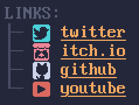

# platform-icons
A set of 16x16 pixel icons for different online platforms, created for [my personal website](https://jrmh.me).



## About
`platform-icons` is a set of 16x16 pixel icons I created to use on my personal website. The size was chosen to make them fit well with [the font](https://int10h.org/oldschool-pc-fonts/fontlist/font?ibm_vga_8x16) I'm using on my personal website.

The icons are displayed in the text color of the HTML Element they're in.

The SVG icons as well as the CSS is generated from [a spritesheet](icons.png) as well as [a labels file](labels.json), using a python script (`generate.py`). The script uses the following libraries (the versions I'm using are notated not because the script requires specific versions, but just for your information):
- [pixels2svg](https://pypi.org/project/pixels2svg/) (0.2.2)
- [Pillow](https://pypi.org/project/pillow/) (10.1.0)

## Usage
1. Include `platform-icons.css` and the `svg/` directory in the same parent directory within your project.
2. Link to `platform-icons.css` in your website.
3. Create icons manually ...
    ```html
    <span class="plicon" data-platform="twitter"></span>
    ```
    ... or append them to links automatically
    ```html
    <a href="https://github.com/Ovidios/" class="plicon-auto">GitHub</a>
    ```

## Included Icons
Since I'm creating these icons as my need for them arises, not very many exist so far.
-  Placeholder icon
-  GitHub
-  Twitter *(or X if you're weird)*
-  itch.io
-  YouTube

## Adding Icons
To add an icon, simply add it to the right of the [existing icons](icons.png), then add an entry in the [labels file](labels.json), which should look as follows:
```json
[
    ...
    {
        "names": ["platform-name-1", "alias-1"],
        "urls": ["platform-1.com", "platform-o.ne"]
    }
]
```

After adding the icon, simply run the `generate.py` python script to generate the updated PNG, SVG, and CSS files.

## Contributions
This is very much a personal *thing*, into the management of which I really don't want to put too much time and effort. As such, while you should feel free to clone this repository, add icons, and whatever you wish, I'm not certain I will be merging any contributions into this repo.